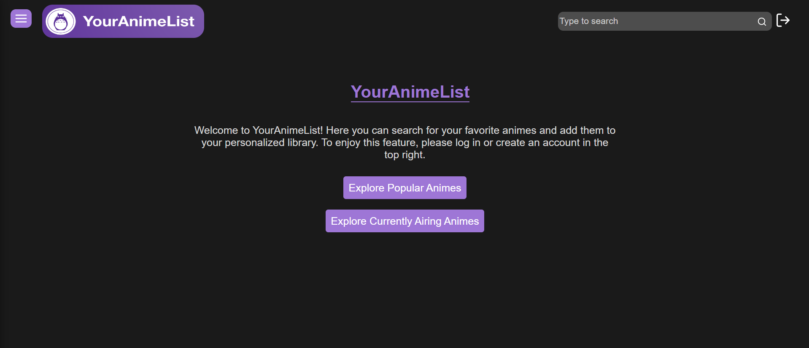
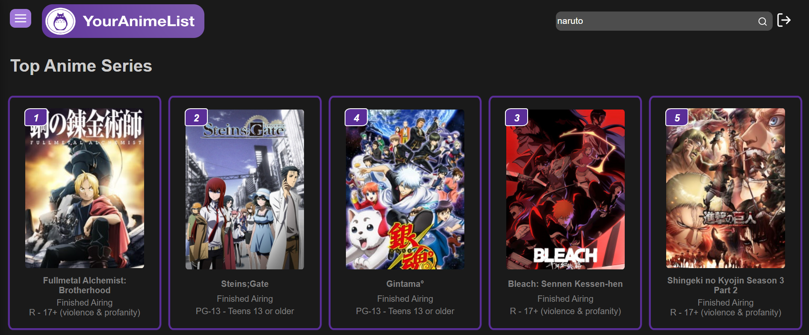
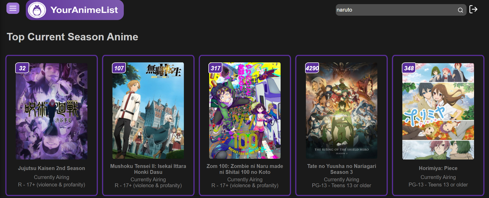
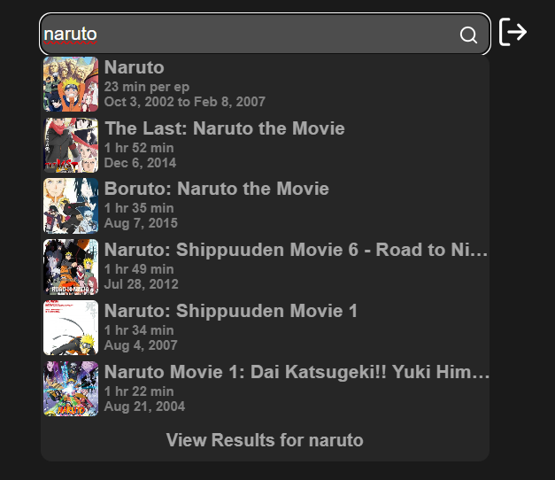
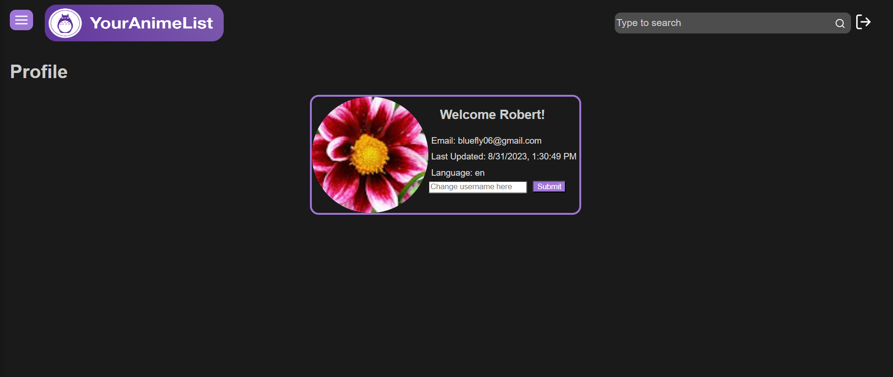
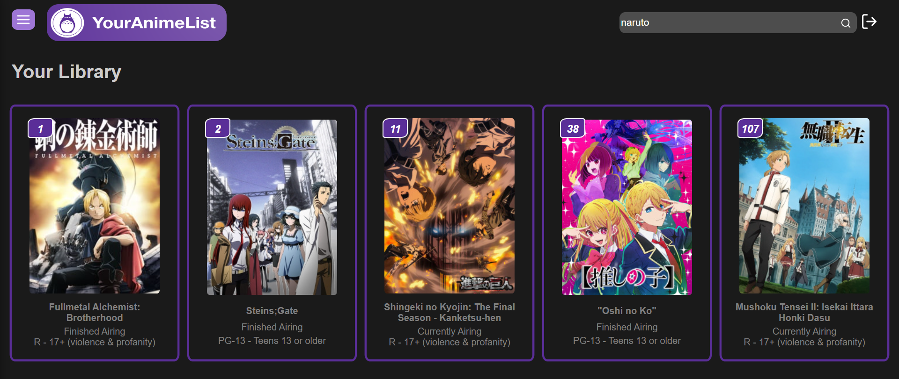

# YourAnimeList

YourAnimeList focuses on delivering a user-friendly navigation experience for anime fans where you can create an account, sign in, and have your own personalized anime list. You can view popular shows based on ratings, explore current airing shows, and use our real-time search bar to find any anime you may want to add.

## Table of Contents

- [Installation](#installation)
- [Usage](#usage)
- [Features](#features)
- [Technologies Used](#technologies-used)
- [Handlers Overview](#handlers-overview)
- [Contact](#contact)

## Installation

To run the frontend of the application:

1. Navigate to the `frontend` directory: `cd frontend`
2. Install the required dependencies: `yarn install`
3. Start the development server: `yarn start`

To run the backend of the application:

1. Navigate to the `backend` directory: `cd backend`
2. Install the required dependencies: `npm install`
3. Start the server using Nodemon: `nodemon server.js`

## Usage

1. Create an account to access the personalized anime list functionality.
2. Browse popular shows based on ratings.
3. Explore currently airing shows to stay up-to-date.
4. Utilize the real-time search bar to find and add new anime titles to your list.

## Features

- Real-time search bar for quick anime discovery.
- Navigation bar for easy access to different sections of the platform.
- Personalized anime list creation and management.

## Technologies Used

- **MERN Stack**: MongoDB, Express.js, React, Node.js for building the application.
- **Auth0**: User integration and authentication.
- **JIKAN API**: Integration of the Jikan API to fetch anime data.

## Handlers Overview

The `handlers.js` file contains a set of functions that interact with the MongoDB database to handle various operations related to user data. These functions serve as the backend API endpoints for managing user information and anime data. [Learn more](handlers.js-overview.md).

## Contact

If you have any questions, feedback, or issues, you can reach out at bluefly06@gmail.com
